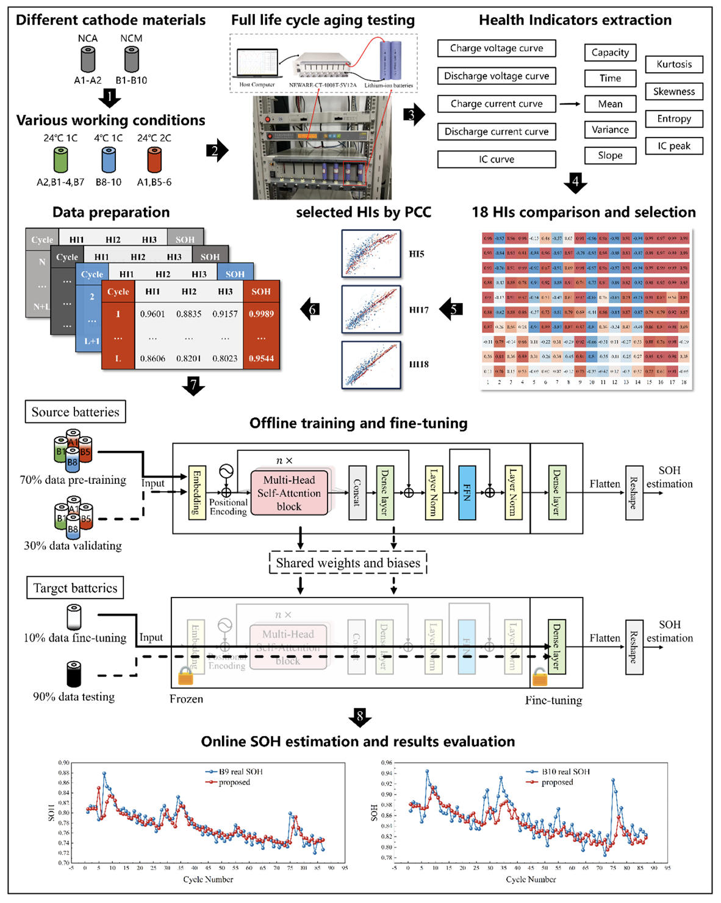
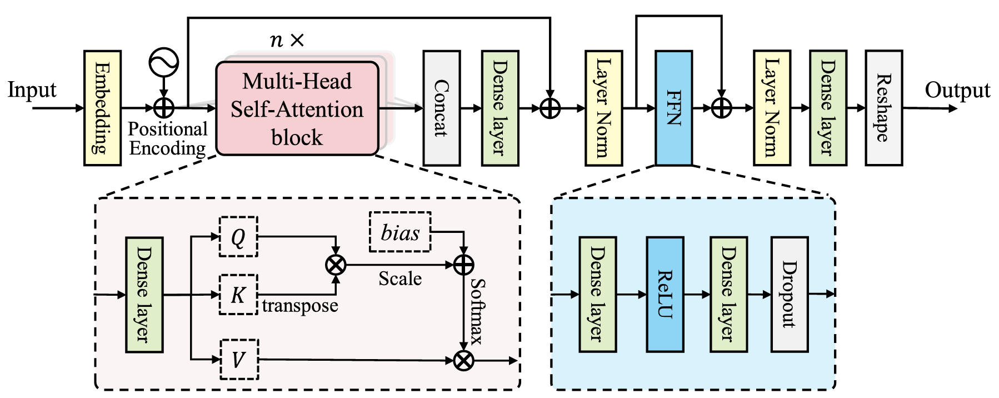
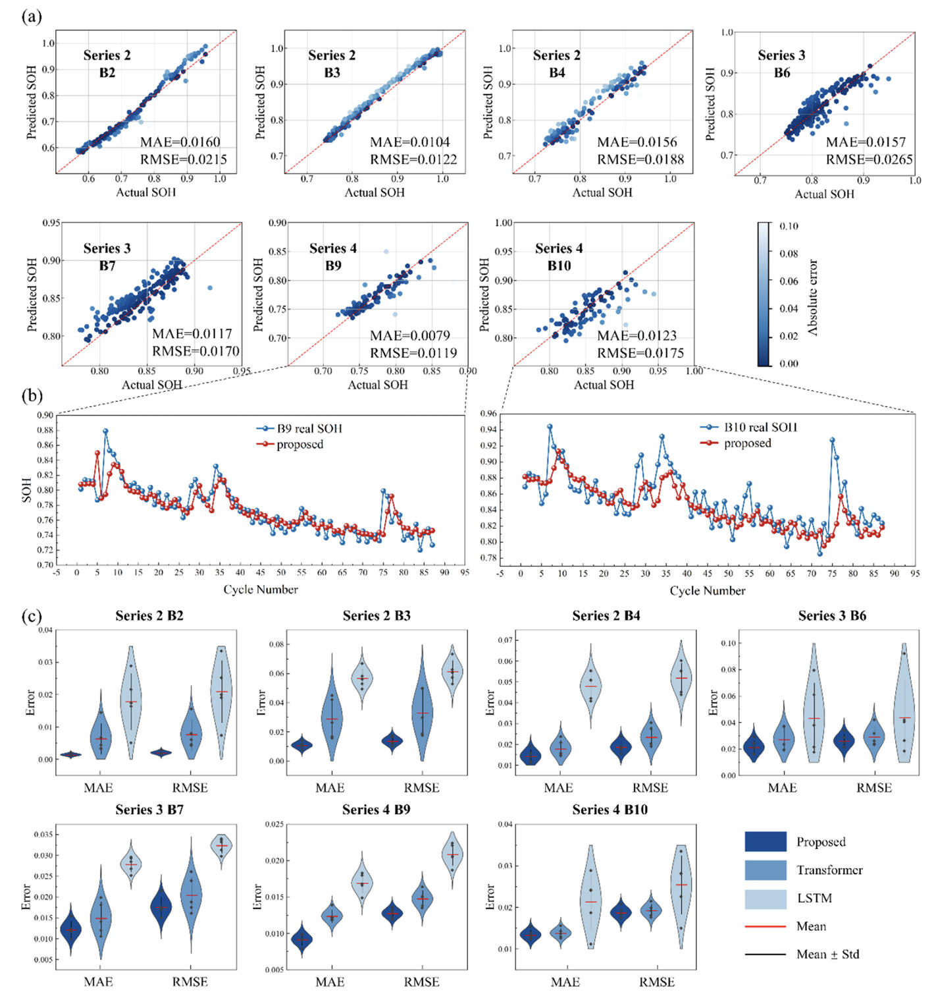

  
  
  
  
  
  
  
  <h1>📚 Reading Notes: SDTL——Self-attention-based Deep Transfer Learning for Online SOH Estimation</h1>
  
Paper: Deep transfer learning enabled online state-of-health estimation of lithium-ion batteries under small samples across different cathode materials, ambient temperature and charge-discharge protocols

  
  

    <a href="./" style="padding: 5px 10px; background: #f0f0f0; border-radius: 4px; text-decoration: none; color: #333;">简体中文</a> | 
    <a href="#readme" style="padding: 5px 10px; background: #333; border-radius: 4px; text-decoration: none; color: #fff; font-weight: bold;">English</a> | 
    <a href="README_es.html" style="padding: 5px 10px; background: #f0f0f0; border-radius: 4px; text-decoration: none; color: #333;">Español</a> | 
    <a href="README_pt.html" style="padding: 5px 10px; background: #f0f0f0; border-radius: 4px; text-decoration: none; color: #333;">Português</a>
  

> **Paper Title**: Deep transfer learning enabled online state-of-health estimation of lithium-ion batteries under small samples across different cathode materials, ambient temperature and charge-discharge protocols  
> **Journal**: Journal of Power Sources (2025, Vol. 650, 237503)  
> **Core Method**: SDTL (Self-attention-based Deep Transfer Learning)  
> **Scope**: Small-sample SOH estimation across cathode materials (NCM/NCA), temperatures, and rates.

## 🔍 Core Problems
Online State-of-Health (SOH) estimation for lithium-ion batteries faces significant challenges:
- **Data Scarcity**: Insufficient early-stage data for new batteries or specific conditions.
- **Variable Conditions**: Significant degradation differences due to cathode materials (e.g., NCM vs. NCA), ambient temperatures (e.g., low temp $4^{\circ}C$), and discharge rates.
- **Model Generalization**: Traditional deep learning models struggle to maintain accuracy on unseen operating conditions without extensive retraining.

## 💡 Methodology: The SDTL Framework
The paper proposes a Self-attention-based Deep Transfer Learning (SDTL) approach. It utilizes large datasets from a source domain for pre-training and rapidly adapts to a target domain using only a small amount of early-cycle data via fine-tuning.

> 📊 **SDTL Framework Diagram**
> 
> *This figure illustrates the SDTL workflow: from data acquisition under various conditions, extraction and selection of Health Indicators (HIs), offline pre-training on the source domain, to online fine-tuning and evaluation using the first 10% of the target domain data.*

### Key Technical Details
1.  **Feature Engineering**:
    -   Extracted 18 Health Indicators (HIs) from voltage, current, and incremental capacity (IC) curves.
    -   Selected 3 key HIs using Pearson Correlation Coefficient (PCC): Constant current discharge time (HI5), Current entropy (HI17), and Current slope (HI18).
2.  **Model Architecture**:
    -   Employs **Multi-Head Self-Attention** to capture long-term dependencies in time-series data.
    -   Incorporates Positional Encoding to preserve sequence information.
3.  **Transfer Strategy**:
    -   **Pre-training**: Training model parameters on source domain data.
    -   **Fine-tuning**: Freezing network layers except for the fully connected layer, which is updated using the first 10% of the target battery data.

> 📊 **Self-Attention Model Structure**
> 
> *Diagram of the self-attention-based network, including Positional Encoding, Multi-Head Attention blocks, Layer Normalization, and Feed-Forward Networks (FFN).*

## 📈 Experimental Results
The model was validated on two datasets (Series A: NCM batteries, Series B: NASA NCA batteries) covering different temperatures ($24^{\circ}C, 4^{\circ}C$) and rates (1C, 2C).

- **Accuracy**: SDTL achieved lower RMSE and MAE compared to baseline Transformer and LSTM models.
- **Small-Sample Adaptation**: Capable of accurate full-lifecycle prediction using only 10% of early-cycle data from the target battery.
- **Comparative Advantage**: Outperformed other transfer learning methods (such as DAAP, DAAD) in terms of both accuracy and stability.

> 📊 **Visualization of SOH Estimation Results**
> 
> *Figure (a) shows estimation results across three battery series; Figure (b) highlights fitting performance under low-temperature ($4^{\circ}C$) conditions; Figure (c) presents the error distribution comparison.*

## 📚 References
- **Citation**: X. Li, M. Zhao*, S. Zhong, J. Li, S. Fu, Z. Yan. Deep transfer learning enabled online state-of-health estimation of lithium-ion batteries under small samples across different cathode materials, ambient temperature and charge-discharge protocols[J]. Journal of Power Sources, 2025, 650: 237503.
- **Data Sources**: In-house NCM battery dataset and NASA Prognostics Repository (NCA).

 

  
© 2026 Tech Blog Notes | Source: <a href="https://doi.org/10.1016/j.jpowsour.2025.237503">Journal of Power Sources</a>

   
  <a href="./">简体中文</a> | 
  <a href="#readme">English</a> | 
  <a href="README_es.html">Español</a> | 
  <a href="README_pt.html">Português</a>

